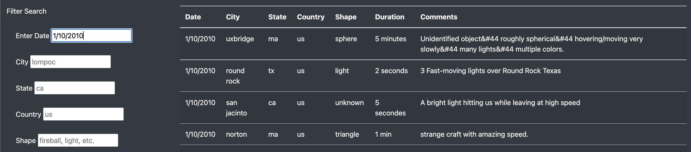
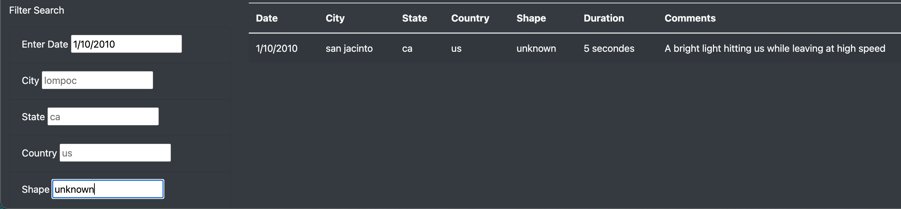
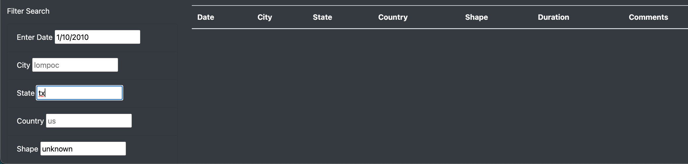

# UFOs

## Overview of Project

### Purpose

The purpose of this analysis is to create a webpage with a dynamic table that has multiple search filters.

## Results

### Performing a search:
- Start by entering a value in any one of the five filter boxes. For example, entering "1/10/2010" in the <i>Enter Date</i> field
- Press the <i>Enter</i> key on your keyboard to refresh the page with your selected filter

- Enter a value in any one of the other field boxes For example, entering "unknown" in the <i>Shape</i> field
- Press the <i>Enter</i> key on your keyboard to refresh the page with your selected filter

- Note, if no results match the filters entered, the table will be blank.

## Summary

### Drawbacks
- 

### Additional recommendations for further development:
1. text
2. text